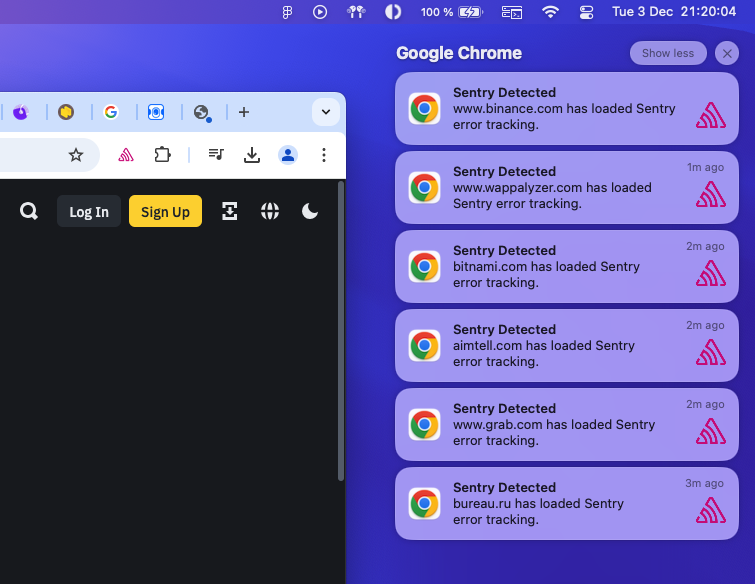

# Is Sentry installed? — Chrome extension

Tiny Chrome extension that checks if Sentry errors catcher is installed on the current page.

## Installation

1. Clone the repository
2. Open Chrome and go to `chrome://extensions/`
3. Enable `Developer mode`
4. Click on `Load unpacked` and select `src` dir in the cloned repository folder

The extension should be installed and ready to use

## Usage

Open any page. The extension will check if Sentry is installed on the current page. If it is, the extension icon will be colored, otherwise it will be grayed out.
